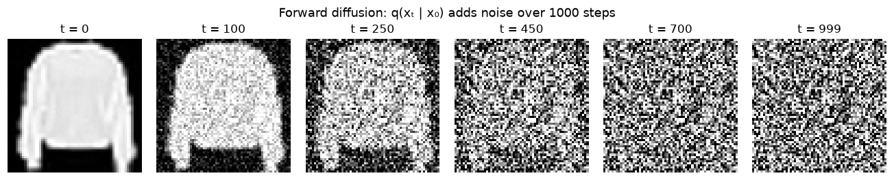
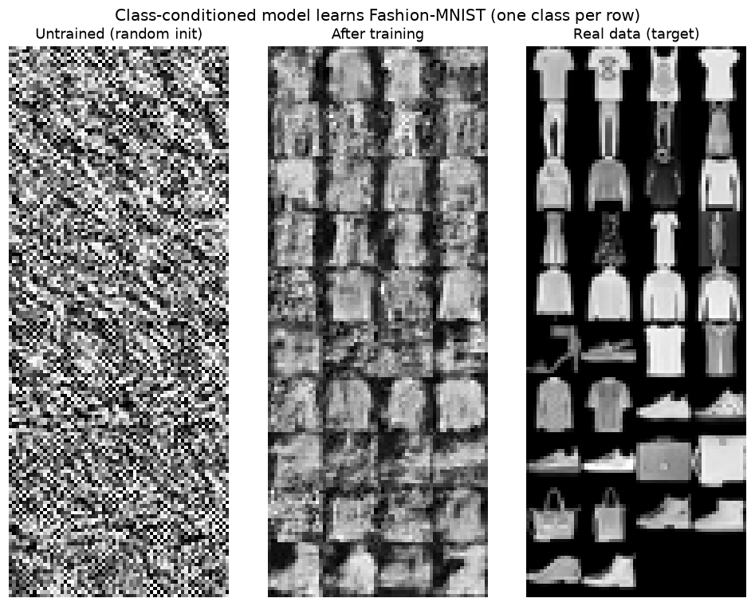
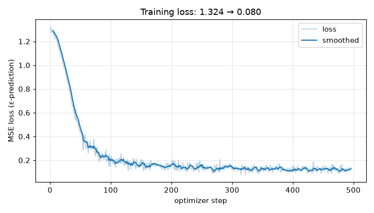
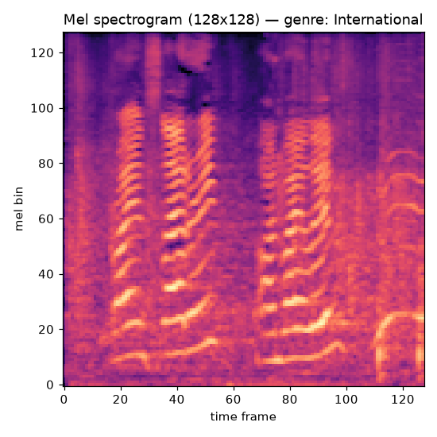
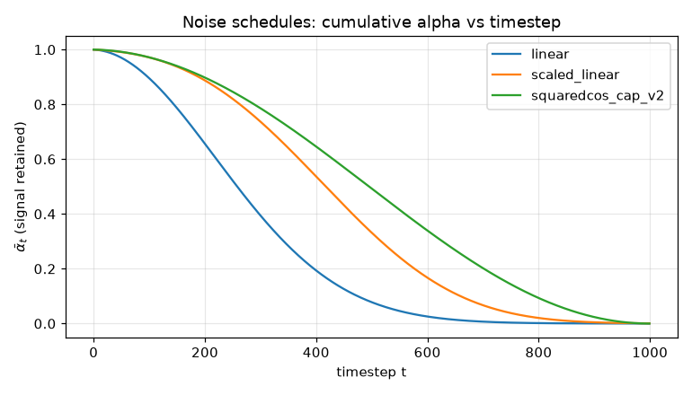

<div align="center">

# difflab

**A production-grade toolkit for diffusion models** — fine-tuning, class-conditioned
generation, DDIM inversion, and audio diffusion, in one cleanly packaged library.

[](https://github.com/ROHITCRAFTSYT/difflab/actions/workflows/ci.yml)
[](https://www.python.org/)
[](LICENSE)
[](https://github.com/astral-sh/ruff)
[](tests/)

</div>

<p align="center">
  
</p>

---

## What this is

`difflab` is a small, well-tested library that implements four diffusion-model
capabilities behind a single config-driven interface. It is built on
[`diffusers`](https://github.com/huggingface/diffusers) primitives wrapped in our
own [`accelerate`](https://github.com/huggingface/accelerate) training loop, so
the same code path runs on a laptop CPU (tiny "smoke" configs) and on a cloud GPU
(full configs).

| Pillar | What it does | Guide |
| --- | --- | --- |
| **Fine-tuning** | Adapt a pretrained image diffusion model to a new dataset | [docs](docs/finetuning.md) · [notebook](notebooks/01_finetuning.ipynb) |
| **Class-conditioned generation** | Train a label-conditioned UNet and sample any class on demand | [docs](docs/class_conditioning.md) · [notebook](notebooks/02_class_conditioned.ipynb) |
| **DDIM inversion** | Deterministically invert a real image to latents, then edit it via prompts | [docs](docs/ddim_inversion.md) · [notebook](notebooks/03_ddim_inversion.ipynb) |
| **Audio diffusion** | Generate audio by diffusing Mel spectrograms and reconstructing the waveform | [docs](docs/audio.md) · [notebook](notebooks/04_audio_diffusion.ipynb) |

---

## Results & evidence

All figures below were produced by this repository's own code, **on CPU**, and
are reproducible with `python scripts/verify_learning.py` and
`python scripts/make_assets.py`.

### The model actually learns

A class-conditioned UNet trained from scratch on Fashion-MNIST (one class per
row). The randomly-initialised model emits noise; after training it produces
recognizable garments matching each class — approaching the real distribution.

<p align="center">
  
</p>

Training loss falls from ~1.0 to well under 0.2 with the standard ε-prediction
objective:

<p align="center">
  
</p>

### Fine-tuning a pretrained model

Loading a pretrained DDPM UNet and sampling with our DDIM sampler yields coherent
images immediately — confirming the model loading + sampling pipeline end-to-end:

<p align="center">
  
</p>

### Audio as spectrograms

The audio pillar treats a fixed-size Mel spectrogram as a single-channel image.
Below is a real music clip rendered to the 128×128 representation the model
diffuses over (and inverts back to audio with Griffin-Lim):

<p align="center">
  
</p>

---

## Verification status

Everything here was executed and checked on a CPU-only machine:

| Check | Result |
| --- | --- |
| `pytest` (scheduler math, UNet, sampling, inversion, audio, smoke-train) | **34 passing** |
| `ruff check .` | **clean** |
| Notebook 01 (fine-tuning) executes end-to-end | ✅ produces coherent images |
| Notebook 02 (class-conditioned) executes end-to-end | ✅ |
| Notebook 03 (DDIM inversion) executes end-to-end | ✅ round-trip error **3.8e-07** |
| Notebook 04 (audio) executes end-to-end | ✅ trains on streamed music, reconstructs audio |
| Forward process matches closed form `√ᾱₜ·x₀ + √(1-ᾱₜ)·ε` | ✅ asserted numerically |

> **Compute note.** Training real diffusion models needs a GPU. Full training is
> meant to run on **Colab/Kaggle** (each notebook has an *Open in Colab* badge);
> the smoke configs and tests run in seconds on CPU and prove correctness, not
> sample quality. The figures above come from short CPU runs and are illustrative.

---

## Quickstart

```bash
# Install (CPU is fine for smoke tests; see requirements-gpu.txt for CUDA)
python -m pip install -e ".[dev]"

# Prove the whole stack works on CPU in a few seconds
pytest -q

# Run a tiny end-to-end training step and write a sample grid
difflab train -c configs/class_conditioned_fashionmnist_smoke.yaml

# Sample specific classes from a trained checkpoint
difflab sample -c configs/class_conditioned_fashionmnist_smoke.yaml \
    --checkpoint outputs/class_cond_smoke/final --labels 0,1,2,3
```

For a real run, open the matching notebook on a GPU and use the non-smoke config.

## Notebooks

| Notebook | Pillar | Colab |
| --- | --- | --- |
| [01_finetuning](notebooks/01_finetuning.ipynb) | Fine-tuning | [](https://colab.research.google.com/github/ROHITCRAFTSYT/difflab/blob/main/notebooks/01_finetuning.ipynb) |
| [02_class_conditioned](notebooks/02_class_conditioned.ipynb) | Class-conditioned | [](https://colab.research.google.com/github/ROHITCRAFTSYT/difflab/blob/main/notebooks/02_class_conditioned.ipynb) |
| [03_ddim_inversion](notebooks/03_ddim_inversion.ipynb) | DDIM inversion | [](https://colab.research.google.com/github/ROHITCRAFTSYT/difflab/blob/main/notebooks/03_ddim_inversion.ipynb) |
| [04_audio_diffusion](notebooks/04_audio_diffusion.ipynb) | Audio diffusion | [](https://colab.research.google.com/github/ROHITCRAFTSYT/difflab/blob/main/notebooks/04_audio_diffusion.ipynb) |

Each notebook's first cell bootstraps itself (installs the package, locates the
configs), so it runs unchanged on Colab/Kaggle or locally.

## How it fits together

```
config (YAML) ──▶ ExperimentConfig ──▶ build_unet / build_scheduler
                                          │
                                          ▼
                                   Trainer (accelerate)
                                   ├─ DDPM ε-prediction objective
                                   ├─ EMA + checkpointing
                                   ├─ cosine LR + warmup
                                   ├─ TensorBoard logging
                                   └─ periodic DDPM/DDIM sampling
                                          │
                                          ▼
                                 push_to_hub (+ model card)
```

## The noise schedules

The forward process is governed by a variance schedule; difflab supports the
three standard ones (cumulative signal retained vs timestep):

<p align="center">
  
</p>

See [docs/theory.md](docs/theory.md) for the full DDPM/DDIM derivation.

## Repository layout

```
src/difflab/        # the library (models, sampling, training, inversion, audio, hub)
configs/            # one YAML per experiment (+ *_smoke variants for CPU/CI)
notebooks/          # one runnable, self-bootstrapping notebook per pillar
scripts/            # train / sample wrappers + verification & asset generation
tests/              # CPU-runnable unit + smoke tests
docs/               # mkdocs site: theory + per-pillar guides
assets/             # figures used in this README (reproducible)
```

## Install

```bash
# CPU (default)
pip install -e ".[dev]"

# GPU (CUDA 12.1) — Colab/Kaggle already ship a CUDA torch
pip install torch torchaudio --index-url https://download.pytorch.org/whl/cu121
pip install -e .
```

## Documentation

```bash
pip install ".[docs]"
mkdocs serve   # http://127.0.0.1:8000
```

## Publishing trained models to Hugging Face Hub

This repository (the **code**) lives on GitHub. Trained model **weights** can
optionally be published to the [Hugging Face Hub](https://huggingface.co/) once
you have run a full (non-smoke) training on a GPU. The toolkit handles upload and
generates a model card automatically.

1. Train a real model on a GPU (e.g. open a notebook on Colab and use the
   non-smoke config).
2. Set the Hub fields in your config and provide a token:

   ```yaml
   hub:
     push_to_hub: true
     repo_id: ROHITCRAFTSYT/difflab-fashionmnist   # your-name/model-name
     private: false
   ```

   ```bash
   export HF_TOKEN=hf_xxx        # a write token from huggingface.co/settings/tokens
   difflab train -c configs/class_conditioned_fashionmnist.yaml
   ```

3. Or push an existing checkpoint directly:

   ```python
   from difflab.config import load_config
   from difflab.hub import push_model_to_hub

   cfg = load_config("configs/class_conditioned_fashionmnist.yaml")
   cfg.hub.push_to_hub = True
   cfg.hub.repo_id = "ROHITCRAFTSYT/difflab-fashionmnist"
   push_model_to_hub("outputs/class_cond_fashionmnist/final", cfg)
   ```

If `HF_TOKEN` is absent, the upload is skipped with a warning — training never
fails just because credentials are missing. See [`src/difflab/hub.py`](src/difflab/hub.py).

## License

MIT — see [LICENSE](LICENSE).
